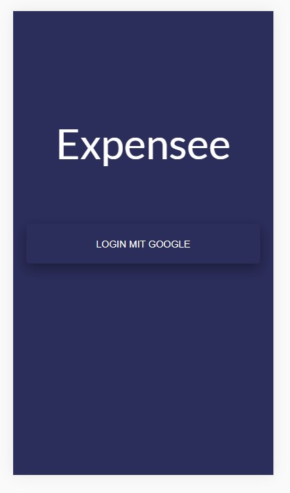

Hello!

The Expansee app allows users to keep track of their costs.
This app is designed for mobile and was built with the MERN stack.
Users can enter their expenses / income details and get an overview of how much money they have spent and how much they have left in the current month. 

#### Getting Started with Create React App
This project was bootstrapped with [Create React App](https://github.com/facebook/create-react-app).

#### `npm start`
Runs the app in the development mode.\
Open [http://localhost:3000](http://localhost:3000) to view it in the browser.

First you will login with your google account to open the app: 

After login you will see the home page with an overview of all expenses/income sorted by date:

You can add a new expense or income and write some details like the category (shopping,leisure, food etc), the date of the expense, an small description and the amount:

In the section "charts" you will see the charts of the total income, expenses and savings of the month:

If you click in the main title, an accordion will be opened with the sums grouped by categories:

